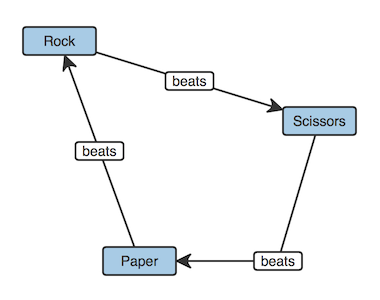

# cmap

Interactive visualization library for concept map



```js
var cmap = Cmap();

var node0 = cmap.node({content: 'Rock', x: 100, y: 100});
var node1 = cmap.node({content: 'Paper', x: 180, y: 320});
var node2 = cmap.node({content: 'Scissors', x: 360, y: 180});

var link0 = cmap.link({content: 'beats'});
var link1 = cmap.link({content: 'beats'});
var link2 = cmap.link({content: 'beats'});

link0
  .sourceNode(node0)
  .targetNode(node2);

link1
  .sourceNode(node1)
  .targetNode(node0);

link2
  .sourceNode(node2)
  .targetNode(node1)
  .attr({
    cx: 356,
    cy: 335
  });
```

## Features

- Draw and construct a concept map in a browser
- Support touch devices
- Standalone, no dependencies

## Usage

```
<script src="cmap.js"></script>
```

Works on IE10+, Firefox, Safari, Chrome

## API

<h4>
Cmap()<br>
Cmap(element)
</h4>

Create a element or wrap a existing element for drawing a concept map.

```js
// create a element in document.body
var cmap = Cmap();
```

```js
// wrap a existing element
var container = document.getElementById('container');
var cmap = Cmap(container);
```

<h4>cmap.node(props)</h4>

Create and draw a node.
You can set the attributes of the node (see [*node.attr()*](#node-attr)).

```js
var cmap = Cmap();

// node with setting the text content, position and size
var node = cmap.node({
  content: 'Rock',
  x: 10,
  y: 20,
  width: 60,
  height: 40
});
```

<h4>cmap.link(props)</h4>

Create and draw a link.
You can set the attributes of the link (see [*link.attr()*](#link-attr)).

```js
var cmap = Cmap();

// link with setting the text content and center position
var link = cmap.link({
  content: 'beats',
  cx: 100,
  cy: 200
});
```

<h4 id="node-attr">
node.attr()<br>
node.attr(key)<br>
node.attr(key, value)<br>
node.attr(props)
</h4>

Get or set given attributes of the node.

<h5>Possible parameters</h5>

- **content**: [string] the text string to draw (default: "")
- **contentType**: [string] name of the content type, "text" or "html" (default: "text")
- **x**: [number] x coordinate of the top left corner (default: 0)
- **y**: [number] y coordinate of the top left corner (default: 0)
- **width**: [number] width (default: 75)
- **height**: [number] height (default: 30)
- **backgroundColor**: [string] background color (default: "#a7cbe6")
- **borderColor**: [string] color of the four sides of a border (default: "#333")
- **borderWidth**: [number] width of the border (default: 2)
- **textColor**: [string] foreground color of the text content (default: "#333")

```js
var node = cmap.node({
  content: 'Rock',
  x: 10,
  y: 20
});

// get all attributes as object
node.attr();

// get the value of an attribute
node.attr('x');

// set the value of an attribute
node.attr('x', 100);

// set multiple attributes
node.attr({
  x: 20,
  y: 30
});
```

<h4>node.remove()</h4>

Remove the node from the concept map.

<h4>node.toFront()</h4>

Move the node on top of other nodes in the z-order.

<h4>node.element()</h4>

Get the DOM element of the node.

<h4 id="node-redraw">node.redraw()</h4>

Normally, creating and updating DOM elements of a concept map is along with the browser's normal redraw cycle (achieved by *window.requestAnimationFrame*).

You can force a synchronous redraw.

```js
var node = cmap.node({
  content: 'Rock'
});

console.log(node.element());        // null (not yet created)

node.redraw();

var element = node.element();

console.log(element);               // [object HTMLDivElement]
console.log(element.textContent);   // Rock

node.attr('content', 'Paper');

console.log(node.attr('content'));  // Paper
console.log(element.textContent);   // Rock (not yet updated)

node.redraw();

console.log(element.textContent);   // Paper
```

<h4>
node.draggable()<br>
node.draggable(true|false)
</h4>

Get or set whether or not to allow dragging the node (default: true).

<h4 id="link-attr">
link.attr()<br>
link.attr(key)<br>
link.attr(key, value)<br>
link.attr(props)
</h4>

Get or set given attributes of the link.

<h5>Possible parameters</h5>

- **content**: [string] the text string to draw (default: "")
- **contentType**: [string] name of the content type, "text" or "html" (default: "text")
- **cx**: [number] x coordinate of the center of the text content (default: 100)
- **cy**: [number] y coordinate of the center of the text content (default: 40)
- **width**: [number] width of the text content (default: 50)
- **height**: [number] height of the text content (default: 20)
- **backgroundColor**: [string] background color of the text content (default: "white")
- **borderColor**: [string] color of the four sides of a border of the text content (default: "#333")
- **borderWidth**: [number] width of the border of the text content (default: 2)
- **textColor**: [string] foreground color of the text content (default: "#333")
- **sourceX**: [number] x coordinate of the starting point of the path (default: *cx* - 70)
- **sourceY**: [number] y coordinate of the starting point of the path (default: *cy*)
- **targetX**: [number] x coordinate of the ending point of the path (default: *cx* + 70)
- **targetY**: [number] y coordinate of the ending point of the path (default: *cy*)
- **lineColor**: [string] color of a border of the path (default: "#333")
- **lineWidth**: [number] width of the border of the path (default: 2)
- **hasArrow**: [boolean] drawing arrow at ending point of the path (default: true)

```js
var link = cmap.link({
  content: 'beats',
  cx: 100,
  cy: 200
});

// get all attributes as object
link.attr();

// get the value of an attribute
link.attr('cx');

// set the value of an attribute
link.attr('cx', 150);

// set multiple attributes
link.attr({
  cx: 200,
  cy: 300
});
```

<h4>link.remove()</h4>

Remove the link from the concept map.

<h4>link.toFront()</h4>

Move the link on top of other links in the z-order.

<h4>link.element()</h4>

Get the DOM element of the link.

<h4>link.redraw()</h4>

Force a synchronous redraw of the link (same as [*node.redraw()*](#node-redraw)).

<h4>
link.draggable()<br>
link.draggable(true|false)
</h4>

Get or set whether or not to allow dragging the link (default: true).

<h4>
link.sourceNode()<br>
link.sourceNode(node)<br>
link.sourceNode(null)
</h4>

Get or set the node which is connected to the starting point of the path.

```js
var link = cmap.link();
var node = cmap.node();

console.log(link.sourceNode());             // null

// connect the node to the starting point of the path
link.sourceNode(node);

console.log(link.sourceNode() == node);     // true

// disconnect the node
link.sourceNode(null);

console.log(link.sourceNode());             // null
```

<h4>
link.targetNode()<br>
link.targetNode(node)<br>
link.targetNode(null)
</h4>

Get or set the node which is connected to the ending point of the path.

```js
var link = cmap.link();
var node = cmap.node();

console.log(link.targetNode());             // null

// connect the node to the ending point of the path
link.targetNode(node);

console.log(link.targetNode() == node);     // true

// disconnect the node
link.targetNode(null);

console.log(link.targetNode());             // null
```

<h4>
link.sourceConnectorEnabled()<br>
link.sourceConnectorEnabled(true|false)
</h4>

Get or set whether or not to enable a connector at the starting point of the path (default: true).

<h4>
link.targetConnectorEnabled()<br>
link.targetConnectorEnabled(true|false)
</h4>

Get or set whether or not to enable a connector at the ending point of the path (default: true).

## Running tests

Clone the repository and install the developer dependencies:

```
git clone https://github.com/ionstage/cmap.git
cd cmap
npm install
```

Then:

```
npm test
```

## License

Copyright &copy; 2015 iOnStage
Licensed under the [MIT License][mit].

[MIT]: http://www.opensource.org/licenses/mit-license.php